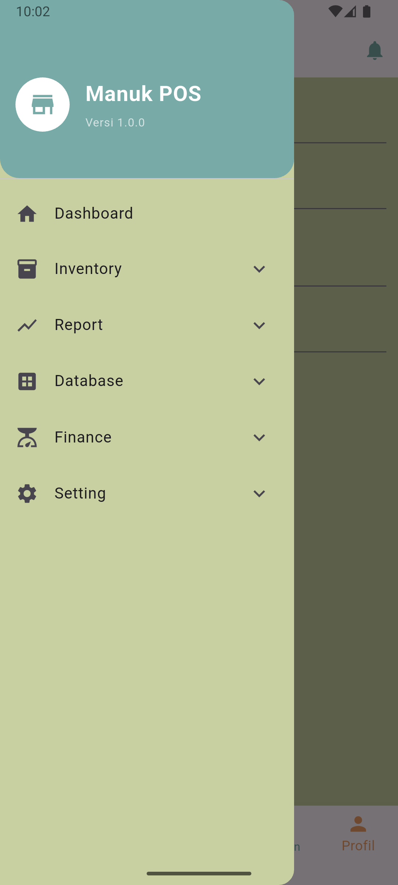
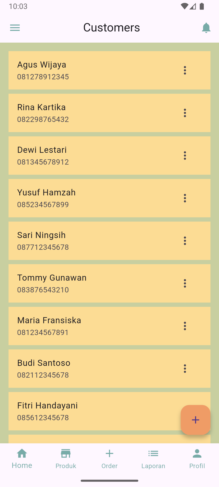
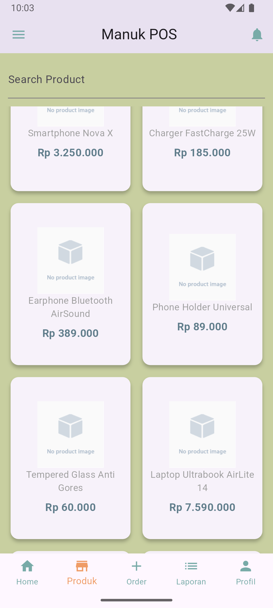
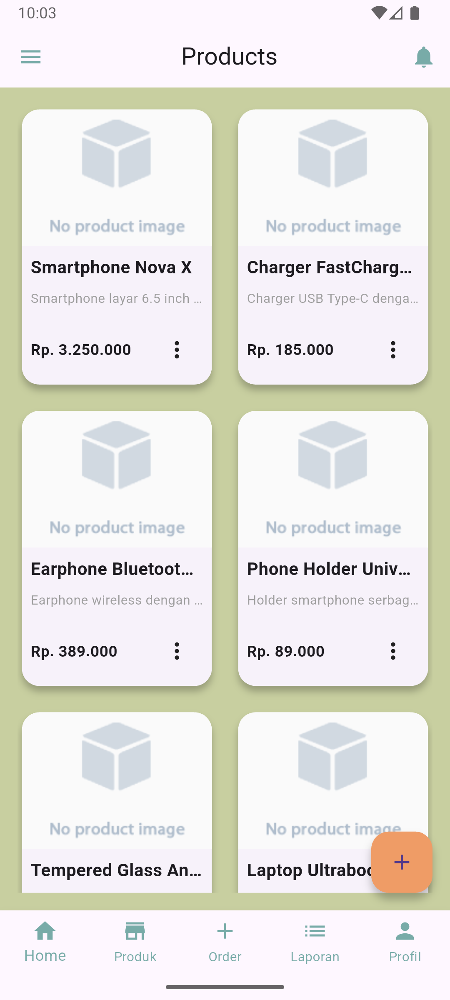
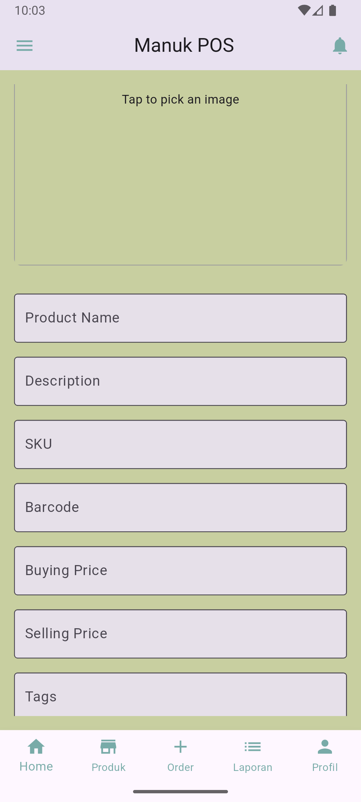

# 🐔 MANUK POS

**MANUK POS (Manajemen UMKM Point of Sale)** adalah aplikasi POS berbasis Flutter yang dirancang untuk membantu pelaku UMKM dalam mengelola transaksi penjualan, pelanggan, produk, inventaris, dan lainnya secara efisien.

Aplikasi ini dibangun menggunakan **Flutter** dengan pendekatan **Clean Architecture**, serta memanfaatkan **Flutter BLoC** sebagai state management utama dan menyimpan data secara **lokal** dan **online**.

---

## 📦 Dependencies

### 🧠 State Management
- **[`flutter_bloc`](https://pub.dev/packages/flutter_bloc)** `^8.0.1` – Mengelola state aplikasi menggunakan pola BLoC.
- **[`equatable`](https://pub.dev/packages/equatable)** `^2.0.7` – Mempermudah perbandingan objek BLoC (event/state).

### 🚦 Routing
- **[`go_router`](https://pub.dev/packages/go_router)** `^15.0.0` – Navigasi deklaratif dengan dukungan nested routes dan deep linking.

### 💾 Local Storage
- **[`shared_preferences`](https://pub.dev/packages/shared_preferences)** `^2.5.3` – Menyimpan data ringan secara lokal seperti token atau preferensi pengguna.

### 🌐 Networking & Functional
- **[`http`](https://pub.dev/packages/http)** `^1.3.0` – Melakukan request HTTP.
- **[`dartz`](https://pub.dev/packages/dartz)** `^0.10.1` – Functional programming helper seperti `Either` dan `Option`.

### 🧩 Dependency Injection
- **[`get_it`](https://pub.dev/packages/get_it)** `^8.0.3` – Service locator untuk DI (Dependency Injection).

### 📷 Media & Image
- **[`image_picker`](https://pub.dev/packages/image_picker)** `^1.1.2` – Mengambil gambar dari kamera atau galeri.

### 🌍 Internationalization
- **[`intl`](https://pub.dev/packages/intl)** `^0.20.2` – Format tanggal, mata uang, dan angka lokal.

### ✨ UI Enhancement
- **[`animate_do`](https://pub.dev/packages/animate_do)** `^4.2.0` – Animasi siap pakai untuk transisi UI.
- **[`flutter_onboarding_slider`](https://pub.dev/packages/flutter_onboarding_slider)** `^1.0.11` – Komponen onboarding interaktif.

### 🎨 UI & Fonts
- **Material Design Icons**: Disertakan secara default.
- **Custom Fonts**:
  - `Roboto-Regular`, `Roboto-Bold`, `Roboto-Italic`.

### 🧪 Development Tools
- **[`flutter_test`](https://api.flutter.dev/flutter/flutter_test/flutter_test-library.html)** – Untuk testing unit dan widget.
- **[`flutter_lints`](https://pub.dev/packages/flutter_lints)** `^5.0.0` – Kumpulan linter resmi dari Flutter untuk menjaga konsistensi kode.

---

## 📁 Assets
- `assets/images/` – Gambar umum aplikasi.
- `assets/images/onboard/` – Gambar ilustrasi untuk onboarding.
- `assets/fonts/` – Custom font (Roboto family).

---

## 🚀 Versi Aplikasi
- **Versi**: `1.0.0+1`
- **Flutter SDK**: `^3.6.2`

---

## 📸 Screenshot (Opsional)

---
